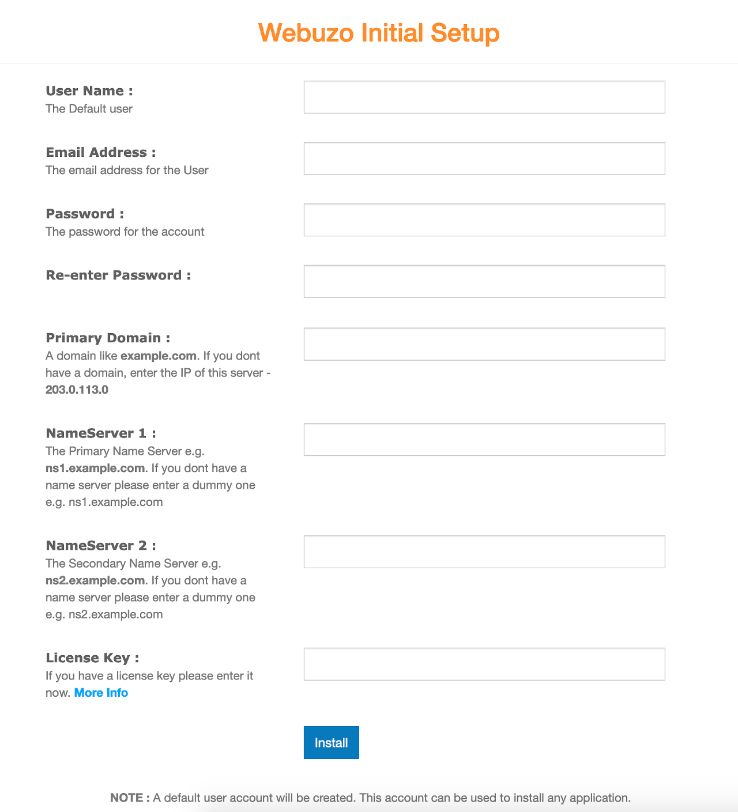
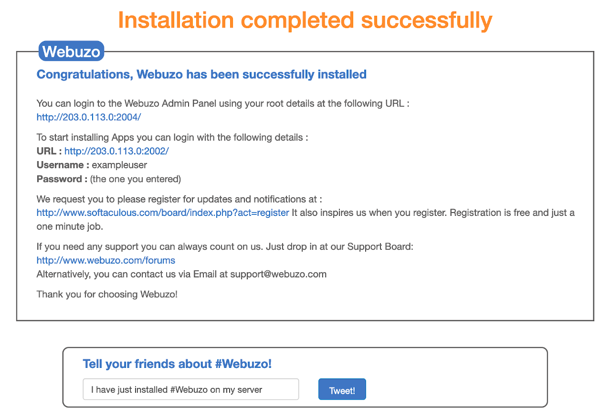
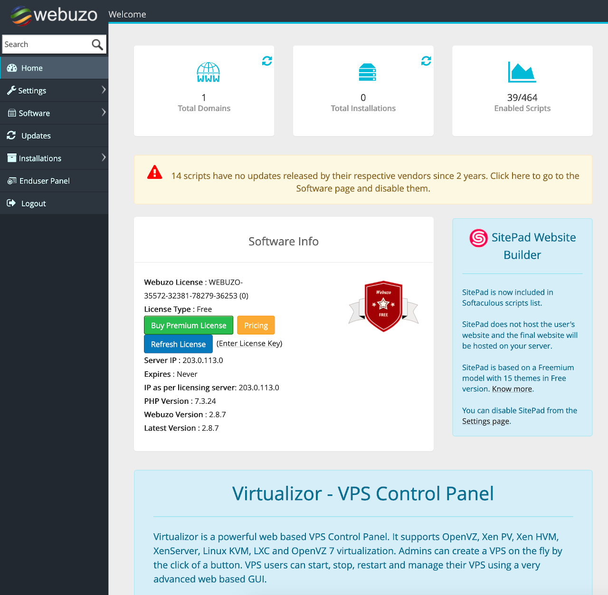
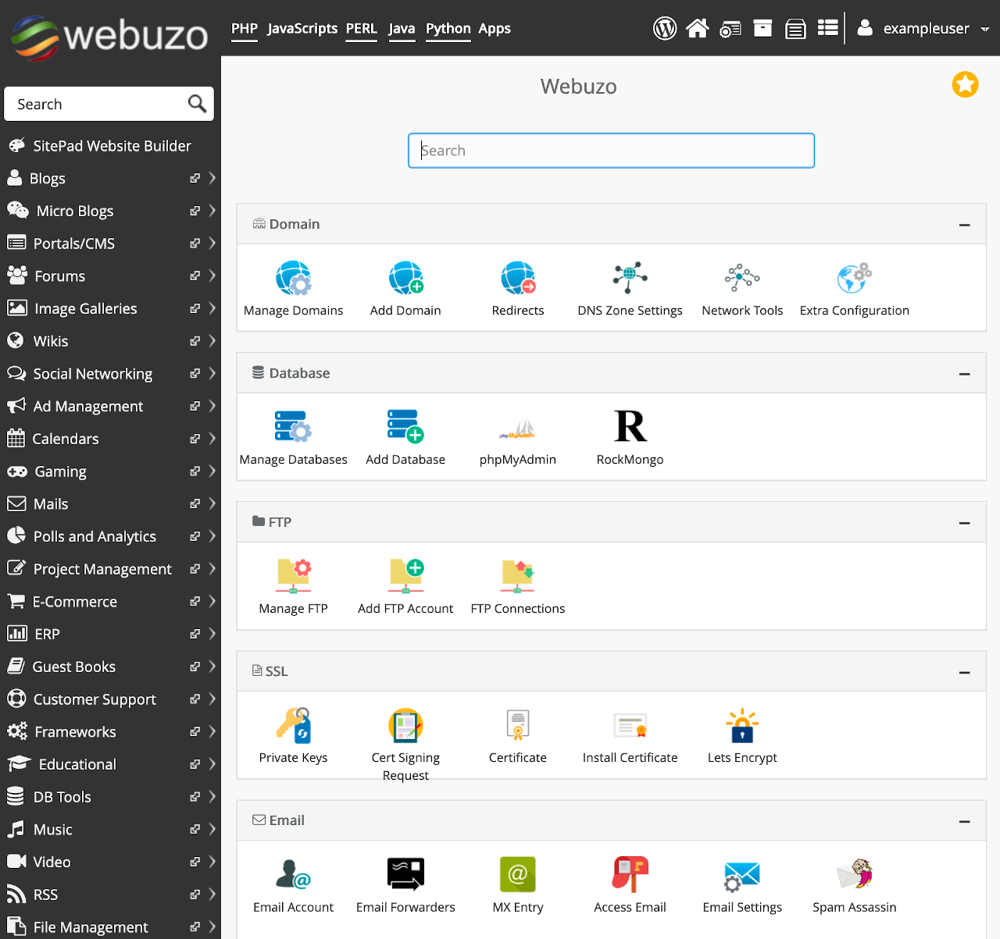

Softaculous [Webuzo](https://www.webuzo.com) is a LAMP stack control panel that allows you to deploy a growing number of applications and scripts on your server with a single click.

## Deploy Webuzo with Marketplace Apps



### Webuzo Options

The Webuzo Marketplace form includes advanced fields to setup your Webuzo server's limited user account and DNS records. These are optional configurations and are not required for installation.

| **Field&nbsp;&nbsp;&nbsp;&nbsp;&nbsp;&nbsp;&nbsp;&nbsp;&nbsp;&nbsp;&nbsp;&nbsp;&nbsp;&nbsp;&nbsp;&nbsp;&nbsp;&nbsp;&nbsp;&nbsp;&nbsp;&nbsp;&nbsp;&nbsp;&nbsp;&nbsp;&nbsp;&nbsp;&nbsp;&nbsp;&nbsp;&nbsp;&nbsp;&nbsp;&nbsp;&nbsp;&nbsp;&nbsp;&nbsp;&nbsp;&nbsp;&nbsp;** | **Description** |
|-----------|-----------------|
| **The limited sudo user to be created for the Linode** | This is the limited user account to be created for the Linode. This account has sudo user privileges. |
| **The password for the limited sudo user** | Set a password for the limited sudo user. The password must meet the complexity strength validation requirements for a strong password. This password can be used to perform any action on your server, similar to root, so make it long, complex, and unique. |
| **The SSH Public Key that will be used to access the Linode** | If you wish to access [SSH via Public Key](https://www.linode.com/docs/security/authentication/use-public-key-authentication-with-ssh/) (recommended) rather than by password, enter the public key here. |
| **Disable root access over SSH?** | Select `Yes` to block the root account from logging into the server via SSH. Select `No` to allow the root account to login via SSH. |

### Linode Options

After providing the app-specific options, provide configurations for your Linode server:

| **Configuration** | **Description** |
|-------------------|-----------------|
| **Select an Image** | Ubuntu 12.10 is currently the only image supported by the Webuzo Marketplace App, and it is pre-selected on the Linode creation page. *Required* |
| **Region** | The region where you would like your Linode to reside. In general, it's best to choose a location that's closest to you. For more information on choosing a DC, review the [How to Choose a Data Center](/docs/platform/how-to-choose-a-data-center) guide. You can also generate [MTR reports](/docs/networking/diagnostics/diagnosing-network-issues-with-mtr/) for a deeper look at the network routes between you and each of our data centers. *Required*. |
| **Linode Plan** | Your Linode's [hardware resources](/docs/platform/how-to-choose-a-linode-plan/#hardware-resource-definitions). You can use any size Linode for your Webuzo App as it uses minimal system resources. The minimum required memory is 1 GB (2GB recommended) and the minimum required free disk space is 5 GB (10 GB recommended). You can always [resize your Linode](/docs/platform/disk-images/resizing-a-linode/) to a different plan later if you feel you need to increase or decrease your system resources. *Required* |
| **Linode Label** | The name for your Linode, which must be unique between all of the Linodes on your account. This name is how you identify your server in the Cloud Manager’s Dashboard. *Required*. |
| **Add Tags** | A tag to help organize and group your Linode resources. [Tags](/docs/quick-answers/linode-platform/tags-and-groups/) can be applied to Linodes, Block Storage Volumes, NodeBalancers, and Domains. |
| **Root Password** | The primary administrative password for your Linode instance. This password must be provided when you log in to your Linode via SSH. The password must meet the complexity strength validation requirements for a strong password. Your root password can be used to perform any action on your server, so make it long, complex, and unique. *Required* |

When you've provided all required Linode Options, click on the **Create** button. **Your Webuzo app will complete installation anywhere between 2-5 minutes after your Linode has finished provisioning**.

## Getting Started after Deployment

Webuzo is now installed and ready to use.

1.  The Webuzo setup wizard is served on port 2004, to access it, navigate to the IP address of your server followed by port 2004. For example, `http://203.0.113.0:2004`, replacing the IP address with values for your server.

    

1.  At the setup screen, fill in the fields and click the **Install** button.

1.  Webuzo Congratulates you on completing the setup and displays an information screen.

    

    Here you find two links. One for the **Admin Panel** and one for the page where you can begin installing applications. The second is called the **Enduser Panel** and you can also access from the Admin Panel. Both require you to login using the user you just created on the setup screen.

    - Admin Panel: `http://your.ip.address:2004`
    - Enduser Panel: `http://your.ip.address:2002`

1.  The Admin Panel allows you to change settings for what scripts and apps you are able to install as well as update those scripts and apps.

    

1.  The Enduser Panel allows you to install a number of applications. It is sorted into sections based on application category.

    


