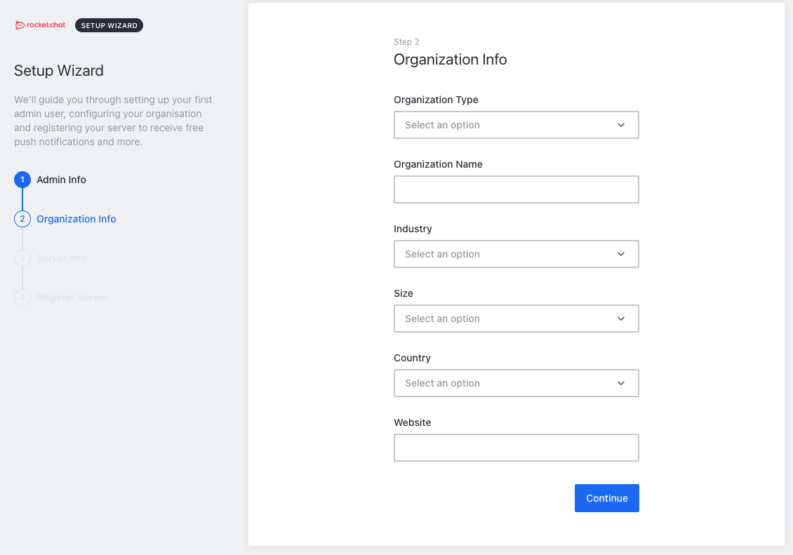

Rocket.Chat is a self-hosted open source chat application that can be used as an alternative to Slack. Rocket.Chat has many key features that you or your business can utilize to improve productivity in the workplace such as video conferencing, group chats, and platform integrations with some of the most popular applications.

## Deploying the Rocket.Chat Marketplace App



**Software installation should complete within 2-5 minutes after the Linode has finished provisioning.**

## Configuration Options

### Rocket.Chat Options

Here are the additional options available for this Marketplace App:

| **Field** | **Description** |
|:--------------|:------------|
| **Your Linode API Token** | Your Linode `API Token` is needed to create DNS records. If this is provided along with the `subdomain` and `domain` fields, the installation attempts to create DNS records via the Linode API. If you don't have a token, but you want the installation to create DNS records, you must [create one](/docs/platform/api/getting-started-with-the-linode-api/#get-an-access-token) before continuing. |
| **Subdomain** | The subdomain you wish the installer to create a DNS record for during setup. The suggestion given is `www`. The subdomain should only be provided if you also provide a `domain` and `API Token`. |
| **Domain** | The domain name where you wish to host your Rocket.Chat instance. The installer creates a DNS record for this domain during setup if you provide this field along with your `API Token`. |
| **Admin Email for the server** | The start of authority (SOA) email address for this server. This email address will be added to the SOA record for the domain. This is a required field if you want the installer to create DNS records. |
| **The limited sudo user to be created for the Linode** | This is the limited user account to be created for the Linode. This account has sudo user privileges. |
| **The password for the limited sudo user** | Set a password for the limited sudo user. The password must meet the complexity strength validation requirements for a strong password. This password can be used to perform any action on your server, similar to root, so make it long, complex, and unique. |
| **The SSH Public Key that will be used to access the Linode** | If you wish to access [SSH via Public Key](/docs/security/authentication/use-public-key-authentication-with-ssh/) (recommended) rather than by password, enter the public key here. |
| **Disable root access over SSH?** | Select `Yes` to block the root account from logging into the server via SSH. Select `No` to allow the root account to login via SSH. |

### General Options

For advice on filling out the remaining options on the **Create a Linode** form, see [Getting Started > Create a Linode](/docs/guides/getting-started/#create-a-linode). That said, some options may be limited or recommended based on this Marketplace App:

- **Supported distributions:** Ubuntu 20.04 LTS
- **Recommended plan:** All plan types and sizes can be used.

## Getting Started after Deployment

### Accessing the Rocket.Chat App

To access your Rocket.Chat instance, Open a browser and navigate to the domain you created in the beginning of your deployment or your Linode rDNS domain `https://li1234-555.members.linode.com`. Replace `https://li1234-555.members.linode.com` with your [Linode's RDNS domain](/docs/guides/remote-access/#resetting-reverse-dns).

From there Rocket.Chat will ask you to fill out multiple forms to get your instance created and ready to use:

Now that you’ve gone through the setup and accessed your Rocket.Chat instance, checkout [the official Rocket.Chat documentation](https://docs.rocket.chat/guides/user-guides) to learn how to further utilize your Rocket.Chat instance.

